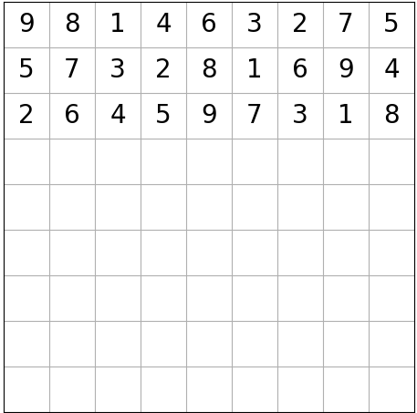
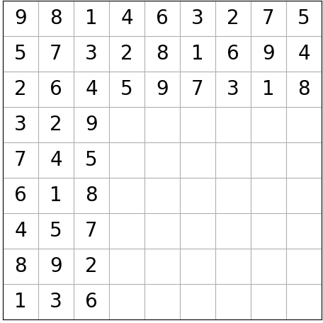
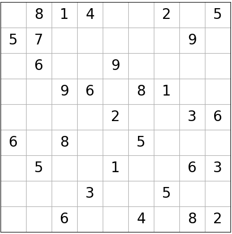

# Sudoku_solver
This is a sudoku board generator and two different kinds of solver, implimented in Python 

---
### Updates & future plans:
- I plan to implement a dancing link version of this solver.  Donald Knuth's algorithm for solving sudoku using exact cover is fascinating, and I plan to update this program once I finish the chapter on exact covering problems in Knuth's TAoCP book 5.
    -   If Knuth's algorithm requires C++, then I'll write it in C++.
- If I feel like it, I will add few more sudoku generators with different approaches to generating "random" boards
- I might make a new implimentation using pandas and numpy to make the 2d array efficient.

---
## Table of Contents:
- [Sudoku Solver](#solver)
- [Sudoku Generator](#generator)
    - [Visual of the Generator](#visual)
- [Output of the Code](#output)

---
  
## My Sudoku Solver
I used recursion ((later found out that its called back-tracking) to solve a sudoku board.

---
I didn't use this method, but some algorithms make filled sudoku in a fast and reliable way, notably the method listed below:
- 1.) Generate a permuted list of 1-9 and placing them on the first row
- 2.) shift the first row by three and put it on the second row
- 3.) shift the second row by three and place it on the third row 
- 4.) shift by 1 for the 4th row, then shift by 3 for 5th and 6th row
- 5.) do step 4 with 7th, 8th, and 9th row
- 6.) using some rules, permute the block row and or column

---
  
## My Sudoku Generator
I didn't use this method because the number of possible sudoku boards is limited, although the number of possible output states is enormous. I wanted to make a pure random sudoku generator that can output all possible states with unique solutions with non-zero probability, so I made a generator using the recursive solver to generate a complete board.
My method of generating a sudoku board is to fill the top 3 blocks with valid random values, then transpose the matrix and fill the "new" top row with valid random values. Then you have a block of rows and a column of rows that are somewhat independent of each other, then use the recursive solver to fill in the rest.  The recursive solver chooses randomly from the possible numbers that can be entered in that cell, so the randomness of the output is not damaged.

---
 
## Visual Interpertation of the Generating Algorithm:
| 1.) fill the top 3 blocks |2.) Transpose the matrix | 3.) & 4.) Fill the new top blocks and transpose it back|
|---------------------------|---------------------------|---------------------------|
|    |    |    |

5.) Then fill the rest with valid random values
---

After the recursive solver makes a filled randomized sudoku board, start making batches of random positions and check the uniqueness of the solution if they're removed.  If the uniqueness is preserved, delete the values in those positions, if there's a divergence in the number of solutions, then use a new random batch and start over.  Exit the removing stage if the required number of entries are removed.  By checking if the number of solutions, we can observe which cell values are vital to preserving the uniqueness of the solution.

---
 
## Outputs:
|Random empty board state:|Solved board state: |
|--------------------------|-----------------------|
| | |